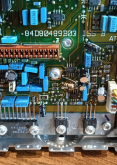

# Hardware modifications

There are 2 things to do:

    Solder a 100k THT resistor in parallel with R552
    Move jumper JU551 to position A

Optionally, you can cut open pin 4 of the power amplifier IC. This allows an access to the internal speaker via 
pins 1 and 15 on the back of the radio. JU551 jumper is visible on the left side, between an electrolytic 
capacitor and 2 (MKP?) blue ones.

